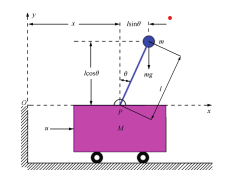

Matlab code for simulating and controling the inverted pendulum on a cart problem.

# Cart-Pole Control Problem

An inverted pendulum is a classic problem in control theory and robotics. It involves a
rigid pendulum that is mounted on a cart, where the objective is to keep the pendulum
balanced in the upright position by moving the cart back and forth. This
problem is challenging because it requires precise control of the cart’s position and velocity
to maintain the pendulum’s equilibrium.

  

The problem can be solved using various control strategies. The classical control approach
involves designing a controller based on mathematical models of the system, while more modern
control techniques use advanced control algorithms to achieve better performance. Optimal control methods aim to minimize a certain cost function while maintaining the pendulum’s
balance.

# Mathematical Statement

Given the Lagrangian of the system, $L(x,x',\theta,\theta')$, which is given by the difference of the kinnetic and potential energy of the system:

$$L(x, x', \theta, \theta '):= \frac{1}{2}(M+m)(x')^2 + mlx'\theta ' \cos{\theta} + \frac{1}{2}ml^2 |\theta ' |^2 - mgl \cos{\theta} $$
Whose partial derivatives are given by:

$$\frac{\partial L}{\partial \theta} = glm \sin{\theta} - lm\theta ' x'\sin{\theta}$$

$$\frac{d}{dt}\left(\frac{\partial L}{\partial \theta '} \right) = -lm x' \theta '\sin{\theta} +lmx'' \cos{\theta}  + l^2m \theta ''$$

$$\frac{\partial L}{\partial x}=0$$

$$\frac{d}{dt}\left(\frac{\partial L}{\partial x '} \right) = -lm |\theta '|^2\sin{\theta}  + (m+M)x'' +lm \theta\cos{\theta} ''$$

Applying Lagrange's theorem we get:

$$\begin{cases}
\theta '' = \frac{1}{l} \left( g\sin{\theta}- x'' \cos{\theta} \right)\\
x'' =  \frac{ml}{(M+m)}\left(- \theta '' \cos{\theta} +|\theta ' |^2 \sin{\theta}\right)
\end{cases}$$

Now we have a system of second order ordinary differential equations describing the problem.

# Numerical Discretization Using the $\text{4}^{th}$ Order Runge-Kutta Method

For the numerical discretization we will use the $\text{4}^{th}$ order Runge-Kutta method. For this purpose we define the following change of variable:

$$v = x ' \text{, } w = \theta ' $$

$$\begin{cases}
x' = f_1 \left( x,\theta,v,t \right) \\
v' = f_2 \left( x,\theta,v,t \right) \\
\theta ' = f_3 \left( x,\theta,w,t \right) \\
w' = f_4 \left( x,\theta,w,t \right)
\end{cases}
$$

Let $\Delta t$ as the time step and let $\theta_i,x_i,v_i,w_i = \theta (t_i), x(t_i),v(t_i), w(t_i)$. The aproximation functions for $x$ are given by:

$$\begin{cases}
K_{1x} = f1(x_i, v_i, \theta_i, w_i,t_i)\\
K_{2x} = f1\left(x_i + \frac{\Delta tK_{1x}}{2},v_i + \frac{\Delta tK_{1v}}{2},
\theta_i + \frac{\Delta tK_{1\theta}}{2}, w_i+\frac{\Delta tK_{1w}}{2},t_i+ \frac{\Delta t}{2}\right)\\
K_{3x} = f1\left(x_i + \frac{\Delta tK_{2x}}{2},v_i + \frac{\Delta tK_{2v}}{2},
\theta_i + \frac{\Delta tK_{2\theta}}{2}, w_i+\frac{\Delta tK_{2w}}{2},t_i+ \frac{\Delta t}{2}\right)\\
K_{4x} = f1(x_i + \Delta t K_{3x}, v_i + \Delta t K_{3v}, \theta_i+\Delta t K_{3\theta}, w_i+\Delta t K_{3w},t_i+\Delta t)
\end{cases}$$

The update step for $x$ is given by $x_{i+1} = x_i + \frac{\Delta t}{6} \left( K_{1x} + 2K_{2x} + 2K_{3x} + K_{4x}\right)$.
The aproximation functions and update step of the remaining variables are analogous.

The following images are results of simulations with timestep $\Delta t = 0.005$ in the time interval $\[0, 10\]$.

  
  
  

    Results of the Simulation with initial conditions $(x,x',\theta,\theta') = (0,0,0.15,0)$, of variable $x$ (right), and $\theta$ (left)

  
  

    Results of the Simulation with initial conditions $(x,x',\theta,\theta') = (0,0.1,1,0)$, of variable $x$ (right), and $\theta$ (left)

# Linearization

Next, we can consider the control problem associated with the pendulum. In this case, we
assume that our control u is an external force applied in the x direction on the cart. In
this case, the equations would be modified using the second law of Newton, and we obtain:

$$\begin{cases}
\theta '' = \frac{1}{l} \left( g\sin{\theta}- x'' \cos{\theta} \right)\\
x'' =  \frac{1}{(M+m)}\left(- ml\theta '' \cos{\theta} +ml|\theta ' |^2 \sin{\theta} + u\right)
\end{cases}$$

If we now introduce the vector of variables $Y = (y_1, y_2, y_3, y_4)^T
 = (x, x'
, \theta, \theta'
)$, the previous equation can be written as a nonlinear ordinary differential system:

$$\frac{d}{dt}Y = F(Y) + G(Y)u$$

Where $F$ and $G$ are as follows:

$$ F(Y) = \begin{cases}
y_1' = y_2\\
y_2' = \frac{mly_4^2 \sin{y_3}-mg\sin{y_3}\cos{y_3}}{(M+m(1-\cos^2{y_3}))}\\
y_3'=y_4\\
y_4' = \frac{1}{l} \left( g\sin{y_3}- (\frac{mly_4^2 \sin{y_3}-mg\sin{y_3}\cos{y_3}}{(M+m(1-\cos^2{y_3}))} ) \cos{y_3} \right)
\end{cases}
\text{  }
G(Y) = \begin{bmatrix}
0 \\
\frac{1}{M+m(1-\cos^2{\theta})}\\
0\\
\frac{-\cos{\theta}}{l(M+m(1-\cos^2{\theta}))}
\end{bmatrix}
$$

To solve this nonlinear problem, we can use different methods, the most common ones
involve linearization. Thus, if we linearize the previous system around 0 (since this is our objective
equilibrium point), we can rewrite the system as follows:

$$\frac{d}{dt}Y = F(0) + DF(0)Y + G(0)u$$

The Jacobian of $F$ at 0 ($DF(0)$) and the vector $G(0)$ are given by:

$$DF(0) = \begin{bmatrix}
0 & 1 & 0 & 0\\
0 & 0 & \frac{-gm}{M}& 0\\
0& 0 &0 & 1\\
0 & 0 & \frac{Mg+gm}{Ml}&0
\end{bmatrix}
\text{   } G(0) = \begin{bmatrix}
    0 \\
    \frac{1}{M} \\
    0 \\
    -\frac{1}{Ml}
\end{bmatrix}$$

This system, being LTI, is easier to control, and behaves simmilarly to the nonlinear system near 0.

